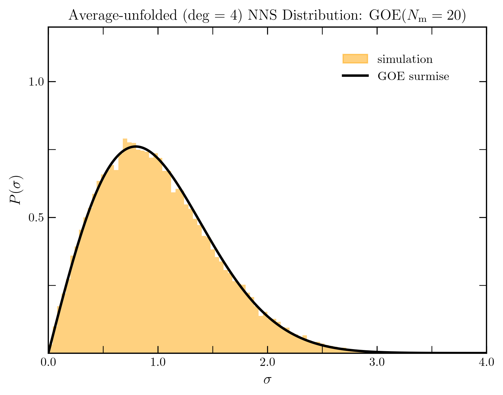
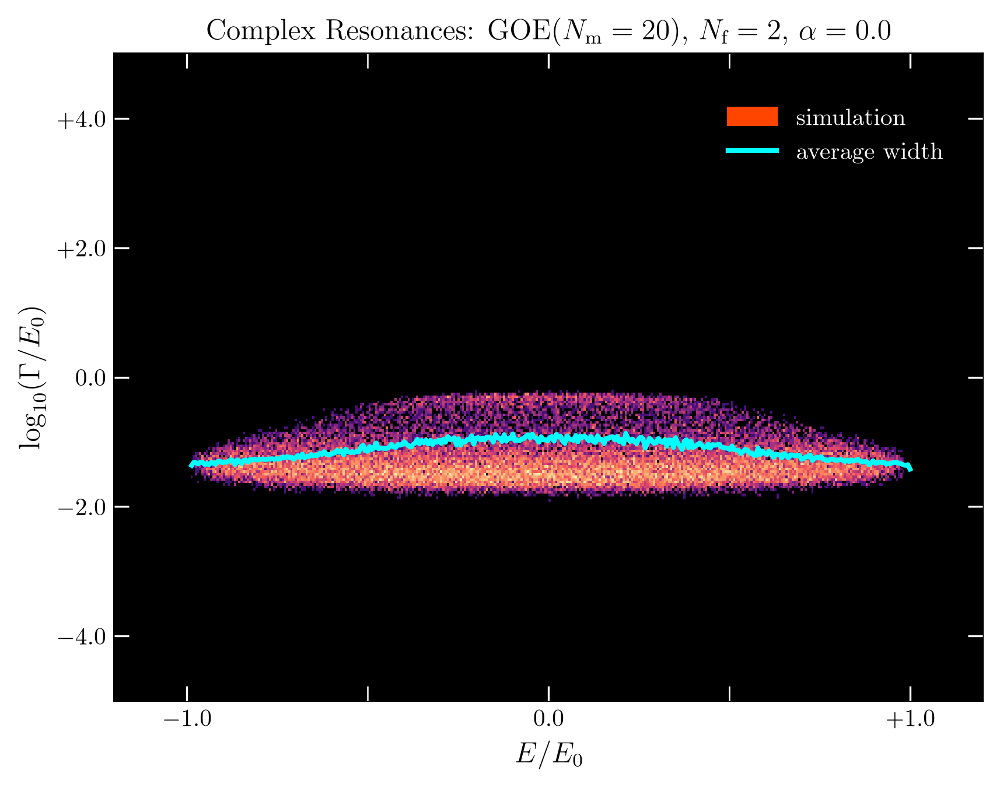
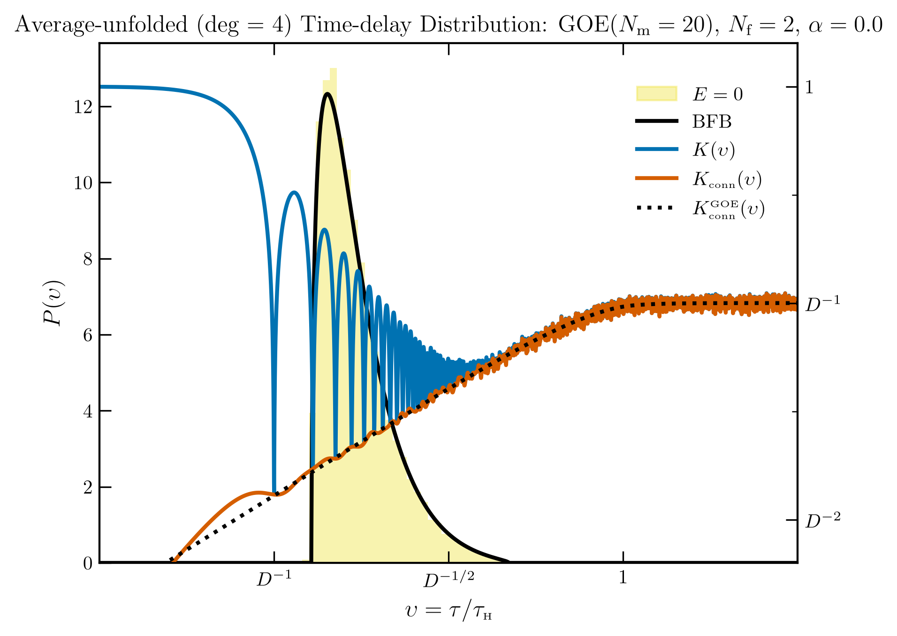
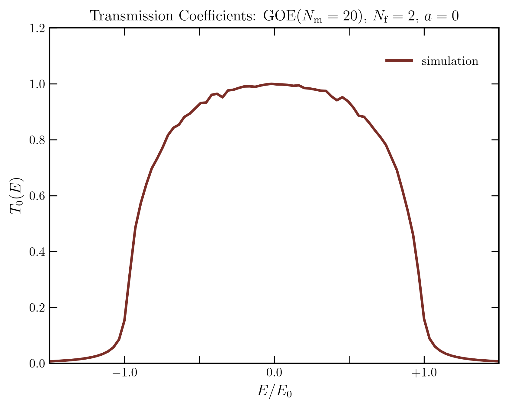

# RMTPy

RMTPy is a Python codebase for numerical studies of random-matrix ensembles,
many-body Hamiltonians, and open quantum systems. It generates closed
Hamiltonians, couples them to decay channels, and accumulates Monte Carlo
statistics for spectra, scattering poles, decay widths, proper delay times, and
transmission coefficients.

A calculation has three main layers. An ensemble supplies one closed random
Hamiltonian realization. A compound adds open channels to that Hamiltonian. A
simulation repeats the calculation and combines the resulting measurements.

```text
closed system
    Ensemble ──► H ──► eigenvalues and eigenvectors
        │                       │
 + open channels                └──► densities, spacings, form factors
        │
        └──► CompoundEnsemble ──► H_eff, K(E), S(E), Q(E)
                                      │
                                      └──► poles, widths, delays, transmissions

physical source ──► Simulation ──► finalized Data ──► NPZ + manifest + plots
```

| Part of the calculation | Implemented capabilities |
| --- | --- |
| Closed ensembles | GOE, GUE, GSE, Bogoliubov–de Gennes classes C and D, Poisson spectra, and the Sachdev–Ye–Kitaev model |
| Fermionic construction | Sparse Majorana and complex-fermion operators, parity blocks, charge conjugation, few-fermion states, and decomposed $`q`$-body monomials |
| Open systems | Effective non-Hermitian Hamiltonians, resonances, partial widths, reaction and scattering matrices, Wigner–Smith matrices, and proper delay times |
| Statistical experiments | Spectral, resonance, partial-width, time-delay, and transmission-coefficient simulations |
| Density analysis | Semicircle, uniform, and $`q`$-Hermite weights; polynomial density expansions; empirical densities; and four forms of unfolding |
| Analytical references | Wigner surmises, Porter–Thomas laws, connected form factors, eigenvalue degeneracies, and a proper-delay density |
| Output | Timestamped run directories containing a manifest, compressed NumPy data, and Matplotlib PNG figures |

## Physical picture

### Closed random Hamiltonians

One realization is one random draw of a Hamiltonian $`H`$. Diagonalizing it
gives an eigenspectrum,

```math
H\lvert n\rangle = E_n\lvert n\rangle.
```

Random matrix theory asks for statistical properties shared by many such
draws. The matrix-entry distribution fixes a global energy scale. Symmetries
fix the allowed matrix structure and the correlations among its eigenvalues.
The latter are organized by the Dyson index $`\beta`$: $`\beta=1`$ for GOE,
$`\beta=2`$ for GUE, and $`\beta=4`$ for GSE. Poisson spectra provide the
uncorrelated reference case with $`\beta=0`$.

Universality means that local spectral fluctuations are governed mainly by
the symmetry class and remain insensitive to many microscopic details. Level
correlations describe how the location of one energy level changes the likely
locations of the others. Their short-range behavior distinguishes correlated
Wigner–Dyson spectra from independent Poisson levels.

RMTPy uses a many-body parity-sector convention for every concrete ensemble.
With $`N_m`$ Majorana modes, the matrix dimension is

```math
D=2^{N_m/2-1}.
```

The Gaussian and Bogoliubov–de Gennes ensembles supply symmetry-controlled
random matrices directly. The SYK ensemble constructs a Hamiltonian from
random even-$`q`$ products of Majorana operators. The Poisson ensemble draws
independent levels and combines them with a random Wigner–Dyson eigenvector
basis.

Different statistics probe different parts of a spectrum:

- The level density records the broad distribution of energies.
- Nearest-neighbor spacings are adjacent differences in the sorted spectrum
  and measure short-range level repulsion. RMTPy accounts for the ensemble's
  declared eigenvalue degeneracy when forming them.
- A spectral form factor measures correlations in the time domain.

For realization $`r`$, RMTPy accumulates

```math
Z_r(t)=\frac{1}{N}\sum_{j=1}^{N}e^{-iE_{rj}t},
```

and forms

```math
K(t)=\frac{1}{R}\sum_{r=1}^{R}\lvert Z_r(t)\rvert^2,
\qquad
K_{\mathrm{conn}}(t)=K(t)-
\left\lvert\frac{1}{R}\sum_{r=1}^{R}Z_r(t)\right\rvert^2.
```

Here $`R`$ is the number of realizations and $`N`$ is the number of levels in
the current sample.

### Opening the system

An open system can exchange probability with external channels. RMTPy
represents the channel amplitudes by a coupling matrix $`W`$ and uses the
effective Hamiltonian

```math
H_{\mathrm{eff}}=H-\frac{i}{2}WW^\dagger.
```

Its complex eigenvalues are scattering poles,

```math
\mathcal E_n=E_n-\frac{i}{2}\Gamma_n.
```

The real part $`E_n`$ is a resonance center. The positive quantity
$`\Gamma_n=-2\mathrm{Im}\,\mathcal E_n`$ is its total decay width.
Resolving the coupling in the eigenbasis of the closed Hamiltonian gives the
partial width of each state into each channel. In units with $`\hbar=1`$, width
sets an inverse lifetime, so a narrow resonance is long lived.

At a real probe energy $`E`$, the code evaluates the reaction and scattering
matrices with the conventions

```math
K(E)=\frac{1}{2}W^\dagger(E-H)^{-1}W,
\qquad
S(E)=[I+iK(E)]^{-1}[I-iK(E)].
```

The Wigner–Smith matrix

```math
Q(E)=-iS^\dagger(E)\frac{\mathrm dS(E)}{\mathrm dE}
```

describes the energy sensitivity of the scattering response. Its eigenvalues
are the proper delay times. Channel transmission is calculated from the
ensemble-averaged diagonal scattering amplitude,

```math
T_a(E)=1-\left\lvert\left\langle S_{aa}(E)\right\rangle\right\rvert^2.
```

$`T_a=0`$ describes a closed or fully reflected channel, while $`T_a=1`$
describes ideal transmission.

## Representative results

The following figures were generated by the current simulation and plotting
code.



*Nearest-neighbor spacings from 100 GOE realizations with $`N_m=20`$. The
degree-four averaged unfolding removes the smooth density before comparison
with the GOE Wigner surmise.*



*The raw complex-energy histogram from 100 GOE compound realizations with
$`N_m=20`$, $`N_f=2`$, and equal couplings $`v_a=\sqrt{20}`$. This choice gives
$`\binom{10}{2}=45`$ open channels. The vertical coordinate is
$`\log_{10}(\Gamma/E_0)`$; the cyan curve is the energy-resolved average width.*



*The degree-four average-unfolded proper-delay distribution at $`E=0`$ from
100 GOE compound realizations with $`N_m=20`$, $`N_f=2`$, and
$`v_a=\sqrt{20}`$. The yellow histogram and black Brouwer–Frahm–Beenakker
(BFB) reference use the left axis. The matching spectral run supplies
$`K(\upsilon)`$ and $`K_{\mathrm{conn}}(\upsilon)`$ on the right axis; the dotted
curve is the universal GOE connected form factor.*



*The channel-zero transmission coefficient from 100 GOE compound
realizations with $`N_m=20`$, $`N_f=2`$, and $`v_a=\sqrt{20}`$ for all 45
channels. The calculation averages $`S_{00}(E)`$ before taking the squared
modulus.*

## Installation

RMTPy currently runs from a source checkout. The project configuration requires
Python 3.14. Create an environment with the runtime dependencies and Ruff, then
run Python from the repository root:

```bash
git clone https://github.com/joshua-leeman/RMTPy.git
cd RMTPy

conda create -n rmtpy-env -c conda-forge \
  python=3.14 numpy scipy numba attrs cattrs matplotlib ruff
conda activate rmtpy-env
```

NumPy supplies arrays and random generators. SciPy supplies sparse matrices,
interpolation, special functions, and BLAS/LAPACK access. Numba compiles the
matrix and polynomial kernels. `attrs` and `cattrs` provide validated records
and structured conversion. Matplotlib produces the figures.

Numerical calculations use no TeX subprocess. Plot generation configures
Matplotlib to use LaTeX, `amsmath`, and the Latin Modern Roman font. Install a
TeX distribution containing those components before calling the plotting
methods or the `run_*_simulation` helpers.

Public imports begin at `rmtpy.ensembles`, `rmtpy.compounds`, and
`rmtpy.simulations`. The top-level `rmtpy` package defines no convenience
imports.

```python
from rmtpy.compounds import CompoundEnsemble
from rmtpy.ensembles import GOE
from rmtpy.simulations import SpectralStatisticsSimulation
```

## Quick start

### Stream one closed and one open realization

This example draws a GOE spectrum, opens the same ensemble with four channels,
and evaluates its poles and delay times.

```python
import numpy as np

from rmtpy.compounds import CompoundEnsemble
from rmtpy.ensembles import GOE

# N_m = 8 gives one parity block with dimension D = 8.
ensemble = GOE(num_majoranas=8, seed=2025)

levels = next(ensemble.eigvals_stream(realizs=1)).copy()
spacings = np.diff(levels)

print(ensemble.dimension)           # 8
print(ensemble.universality_class)  # GOE
print(levels.shape)                 # (8,)
print(spacings.shape)               # (7,)

# N_f = 1 gives C = binom(4, 1) = 4 open channels.
compound = CompoundEnsemble(
    ensemble=ensemble,
    num_free_complex_fermions=1,
)

poles = next(compound.resonances_stream(realizs=1)).copy()
resonance_centers = poles.real
resonance_widths = -2.0 * poles.imag

delay_times, closed_levels = next(
    compound.time_delays_stream(
        realizs=1,
        energies=np.array([0.0]),
    )
)
delay_times = delay_times.copy()
closed_levels = closed_levels.copy()

print(compound.num_channels)   # 4
print(poles.shape)             # (8,)
print(delay_times.shape)       # (1, 4): one energy, four channels
```

Methods ending in `_stream` yield one realization at a time. Several streams
reuse their working arrays for subsequent draws. Copy a yielded array when it
must remain unchanged after the iterator advances.

### Run, save, plot, and reload a simulation

A simulation combines many realizations into finalized histograms and moment
averages. The following example uses a small degree-zero configuration. It
constructs raw and weight-unfolded statistics without polynomial calibration.

```python
from pathlib import Path

from rmtpy.ensembles import GOE
from rmtpy.simulations import (
    SpectralStatisticsSimulation,
    load_spectral_statistics_simulation,
)

simulation = SpectralStatisticsSimulation(
    ensemble=GOE(
        num_majoranas=8,
        max_spectral_polynomial_degree=0,
        seed=7,
    ),
    realizs=64,
)

simulation.execute()

# Finalized Data objects remain on the completed simulation.
raw_levels = simulation.raw_buffers.levels
print(raw_levels.bins)
print(raw_levels.histogram)

run_dir = simulation.save(Path("outputs"))
simulation.plot(run_dir)  # Requires the LaTeX setup described above.

restored = load_spectral_statistics_simulation(directory=run_dir)
print(restored.raw_buffers.levels.histogram)
```

`execute()` fills the simulation in place and returns `None`. `save()` returns
the exact timestamped run directory. `plot()` reads the saved data in that
directory and writes each PNG beside its NPZ file. The family loader rebuilds a
completed simulation with its data and final random-generator state.

Every family also exports a `run_*_simulation` helper. For example,
`run_spectral_statistics_simulation(...)` constructs the simulation, executes
it, saves it under `outputs/`, reloads the saved run for plotting, and returns
the completed in-memory simulation.

## Ensemble catalogue

The concise aliases in the first column are exported alongside the full class
names.

| Alias | Class | Matrix or spectral structure | $`\beta`$ | Density weight and polynomial basis |
| --- | --- | --- | ---: | --- |
| `GOE` | `GaussianOrthogonalEnsemble` | Real symmetric Gaussian matrix | 1 | Semicircle and Chebyshev-$`U`$ |
| `GUE` | `GaussianUnitaryEnsemble` | Complex Hermitian Gaussian matrix | 2 | Semicircle and Chebyshev-$`U`$ |
| `GSE` | `GaussianSymplecticEnsemble` | Self-dual Hermitian matrix with Kramers degeneracy | 4 | Semicircle and Chebyshev-$`U`$ |
| `BdGC` | `BogoliubovDeGennesCEnsemble` | Particle-hole-symmetric block matrix | 2 | Semicircle and Chebyshev-$`U`$ |
| `BdGD` | `BogoliubovDeGennesDEnsemble` | Imaginary antisymmetric Hermitian matrix | 2 | Semicircle and Chebyshev-$`U`$ |
| `Poisson` | `PoissonEnsemble` | Independent uniform levels with a selectable Wigner–Dyson eigenvector basis | 0 | Uniform and Legendre |
| `SYK` | `SachdevYeKitaevEnsemble` | Random even-$`q`$ Majorana Hamiltonian | Derived from $`q`$ and $`N_m`$ | $`q`$-Hermite |

All concrete constructors are keyword-only. They share these controls:

- `num_majoranas` is even and lies between 4 and 32. It sets
  $`D=2^{N_m/2-1}`$.
- `interaction_strength` is positive and defaults to 1. For the Gaussian,
  BdG, and Poisson ensembles, the nominal spectral radius is $`E_0=N_mJ`$.
- `max_spectral_polynomial_degree` is a nonnegative integer and defaults to 6.
- `dtype` defaults to `complex128`. The ensemble derives the corresponding
  real and complex working dtypes.
- `seed` accepts the forms supported by `numpy.random.default_rng`.

At the lowest level, `matrix_stream()`, `eigsys_stream()`, and
`eigvals_stream()` produce matrices, eigensystems, and eigenvalues one
realization at a time.

`PoissonEnsemble.eigvec_ensemble_flag` accepts `"GOE"`, `"GUE"`, or `"GSE"`
and defaults to `"GUE"`. The level and eigenvector generators share one NumPy
random generator, so their sampling order is reproducible from the same initial
state.

SYK accepts `q` in `{2, 4, 6, 8, 10}` with `q < num_majoranas` and an
`is_even_parity` flag. Its supported size limits reflect storage for the
decomposed Majorana monomials:

| $`q`$ | Maximum $`N_m`$ |
| ---: | ---: |
| 2 or 4 | 32 |
| 6 | 26 |
| 8 | 24 |
| 10 | 22 |

For `q=2`, the code uses Poisson spectral references. For larger `q`, it uses
GOE when `q % 4 == 0` and `num_majoranas % 8 == 0`, GSE when `q % 4 == 0` and
`num_majoranas % 8 == 4`, and GUE for the remaining cases.

The `MajoranaFermionBasis` builds its expensive sparse objects lazily. These
include the Majorana operators, creation and annihilation operators, the
vacuum, charge conjugation, the selected parity slice, and decomposed
$`q`$-body monomials.

## Compound ensembles and open channels

Three public compound classes cover the open-system constructions:

| Class | Closed source and coupling construction |
| --- | --- |
| `CompoundEnsemble` | A non-Poisson many-body ensemble with basis-state channel couplings |
| `PoissonCompoundEnsemble` | A Poisson spectrum with channel rotation supplied by its selected eigenvector ensemble |
| `SYKCompoundEnsemble` | An SYK model with few-fermion channel states and a sparse width matrix |

If `num_free_complex_fermions` is $`N_f`$, the number of open channels is

```math
C=\binom{N_m/2}{N_f}.
```

The integer $`N_f`$ ranges from zero through $`N_m/2`$ and defaults to one. The
channel count must fit within the Hilbert-space dimension. Use
`PoissonCompoundEnsemble` for a `PoissonEnsemble`; `CompoundEnsemble` accepts
the other many-body ensembles. The `couplings` argument accepts one positive
finite scalar or a real, finite, nonnegative sequence of length $`C`$. RMTPy
copies a supplied sequence and marks the stored array read-only. The default
coupling for every channel is the square root of the ensemble spectral radius.

`SYKCompoundEnsemble` requires the parity of $`N_f`$ to match the selected SYK
parity sector. A symplectic SYK compound also requires equal coupling strengths
within each Kramers pair.

Compound objects expose the following streams:

- `effective_hamiltonian_stream()` and `resonances_stream()`;
- `resonance_real_parts_stream()` and `partial_widths_stream()`;
- `reaction_matrix_stream()`, `reaction_matrix_pair_stream()`, and
  `scattering_matrix_stream()` over an energy array;
- `wigner_smith_matrix_stream()` and `time_delays_stream()`.

## Simulations

RMTPy provides five completed Monte Carlo simulation families. Each class is
available from `rmtpy.simulations` and from its family subpackage.

| Simulation | Required scientific inputs | Finalized products |
| --- | --- | --- |
| `SpectralStatisticsSimulation` | `ensemble`, `realizs` | Density-coefficient histograms, levels, nearest-neighbor spacings, spectral form factors, and connected form factors |
| `ResonanceStatisticsSimulation` | `compound`, `realizs` | Resonance-density coefficients, centers, widths, spacings, two-dimensional complex-energy densities, and resonance form factors |
| `PartialWidthsStatisticsSimulation` | `compound`, `width_indices`, `realizs` | Selected partial-width and total-width histograms, each scaled by its observed mean |
| `TimeDelayStatisticsSimulation` | `compound`, `energies`, `realizs` | Proper-delay histograms for every requested probe energy, with optional matching spectral-form-factor overlays |
| `TransmissionCoefficientsSimulation` | `compound`, `channel_indices`, `realizs` | Energy-resolved transmission for selected channels and one all-channel Weisskopf estimate |

Partial-width selectors have two forms. `(state, channel)` selects one partial
width. `(state,)` selects the total width of that state, summed over all
channels. Selectors must be unique and within the state and channel bounds.

Time-delay probe energies are copied into a contiguous, read-only `float64`
array. The input must be scalar or one-dimensional, finite, nonempty, and free
of duplicate values. Pass a completed spectral run as
`spectral_statistics_directory` when plotting or using the run helper to
overlay its matching raw and unfolded form factors. The ensemble configuration
and time range must match; its seed and realization count may differ.

Transmission simulations use a fixed 100-point grid spanning 1.5 times the
ensemble density's plotting range. `channel_indices` chooses the individual
$`T_a(E)`$ curves retained for output. The accompanying Weisskopf estimate

```math
\Gamma_{\mathrm W}(E)=\frac{d(E)}{2}\sum_{a=1}^{C}T_a(E),
\qquad
d(E)=\frac{1}{D\rho_{\mathrm{weight}}(E)},
```

always includes every channel in the compound. Points with zero spectral
weight are stored as undefined values.

### Execution lifecycle

Each simulation instance accepts one execution attempt:

```text
NEW ──► RUNNING ──► COMPLETE
              └──► FAILED
```

Completion and failure are terminal states. A completed simulation is
iterable; iteration yields each finalized `Data` object in its defined storage
order. Saving and plotting require `COMPLETE`. Plotting also requires the NPZ
files already written by `save()`.

Every family exports the same function pattern:

- `run_<family>_simulation(...)` executes, saves, plots, and returns the
  completed simulation;
- `load_<family>_simulation(directory=...)` reconstructs a saved simulation;
- `plot_<family>_simulation(directory=...)` loads a run and dispatches every
  stored data object to its plot class.

## Density estimation and unfolding

Raw energies contain the smooth variation of the mean density together with
the fluctuations under study. Unfolding maps the energy coordinate through a
cumulative distribution function $`F`$:

```math
\widetilde E=D[F(E)-F(0)].
```

One unit in the unfolded coordinate corresponds approximately to one local
mean level spacing. A finite resonance width is transformed over its full
energy interval:

```math
\widetilde\Gamma=
D\left[F\left(E+\frac{\Gamma}{2}\right)-
F\left(E-\frac{\Gamma}{2}\right)\right].
```

Spectral, resonance, and time-delay simulations construct four views where the
underlying density supports them:

| View | CDF used by the calculation |
| --- | --- |
| Raw | Original energies or widths in model units |
| Weight-unfolded | The ensemble's leading semicircle, uniform, or $`q`$-Hermite weight |
| Averaged-unfolded | Polynomial coefficients averaged over additional ensemble samples, with one result for every truncation degree |
| Variate-unfolded | Coefficients fitted to each realization, with one result for every truncation degree |

For a density histogram with bin count $`n_i`$ and bin width $`\Delta_i`$, the
finalized value is

```math
h_i=\frac{n_i}{\left(\sum_j n_j\right)\Delta_i}.
```

This normalization integrates to one over the samples that fall inside the
declared histogram support.

For `max_spectral_polynomial_degree=M`, coefficient histograms and averaged and
variate groups are created for every degree from 1 through $`M`$, including odd
degrees. Setting `M=0` leaves the raw and weight-unfolded groups and avoids the
polynomial groups and averaged-density calibration. For densities with a
polynomial expansion, the degree-zero raw spectral and resonance plots still
overlay the polynomial weight as a reference curve.

Spectral and resonance coefficient samples must be finite. Each coefficient
degree uses Freedman–Diaconis bin edges derived after all realizations have
been accumulated, so the saved support retains every finite sample. The plots
use a symmetric window around the central 1st–99th-percentile mass, and all
coefficient plots in one spectral or resonance run share the widest such
horizontal scale.

Spectral statistics use `ensemble.spectral_density`. Resonance statistics use
`compound.resonance_density` and fit the resonance centers. In an unfolded
two-dimensional complex-energy histogram, the horizontal axis remains the
physical center $`E/E_0`$, while the vertical width is unfolded. Time-delay
statistics transform $`1/\tau`$ as a width about the fixed probe energy and
then take the reciprocal.

An averaged density calibration draws

```text
max(8192 // dimension, 10)
```

additional samples when its coefficient cache is first needed. Calibration
and the main simulation use the same ensemble random generator. The initial
cache state therefore forms part of the sampling order, and the manifest
records whether calibration was already cached or was computed during
execution.

## Analytical references

`rmtpy.universal` contains the formulas used by the plots and direct ensemble
methods:

- symmetry labels and eigenvalue degeneracies for $`\beta=0,1,2,4`$;
- Poisson and Wigner-surmise spacing densities;
- single-channel and multi-channel Porter–Thomas width densities;
- connected GOE, GUE, GSE, and Poisson spectral form factors;
- the compact-support proper-delay density used for the time-delay comparison.

The `DensityModel` in `rmtpy.density` combines a support, a sample stream, an
optional orthogonal-polynomial family, and its weight. It supplies PDFs, CDFs,
ensemble-average coefficients, realization-specific coefficients, and the
interpolators used by unfolding. `rmtpy.polynomials` implements the
Chebyshev-$`U`$, Legendre, and $`q`$-Hermite recurrences and weights.
`rmtpy.fermions` supplies the sparse Majorana and complex-fermion operators,
parity projections, $`q`$-body monomials, and few-fermion channel states used by
the SYK constructions.

## Saved runs and plots

`Simulation.save(root)` writes beneath a readable path derived from the
simulation family and physical source. Selected entries from a spectral run
have the form

```text
outputs/
└── spectral_statistics_simulation/
    └── GOE/Nm_8/J_1p0/max_polydeg_0/realizs_64/
        └── 2026-10-01T23:53:25.711519Z/
            ├── manifest.json
            ├── spectral_histogram/
            │   ├── spectral_histogram_data.npz
            │   └── spectral_histogram_plot.png
            ├── nn_spacings_histogram/
            │   ├── nn_spacings_histogram_data.npz
            │   └── nn_spacings_histogram_plot.png
            └── spectral_form_factors/
                ├── spectral_form_factors_data.npz
                └── spectral_form_factors_plot.png
```

Compound paths add $`N_f`$ and the coupling value or a stable coupling-array
identifier. Each execution receives a UTC timestamp directory.

The manifest records:

- the simulation class and normalized constructor configuration;
- the seed policy, bit generator, and initial and final RNG states;
- the real and complex NumPy dtypes;
- execution state and UTC completion time;
- averaged-density calibration coefficients and their timing when applicable.

Each data object is stored as a compressed NPZ archive with its concrete Python
class, initializer fields, numeric arrays, and metadata. Loading uses
`allow_pickle=False`. Plot classes receive the saved manifest, reconstruct the
required ensemble or compound as detached plotting context, and use the
recorded calibration. A PNG is written atomically beside its data archive, and
an existing plot path is preserved.

## Numerical behavior and limits

- Matrix construction and polynomial recurrences use Numba. The first call to
  a compiled kernel includes JIT compilation time.
- Eigensystems use SciPy BLAS/LAPACK. Dense diagonalization costs
  $`O(D^3)`$, while $`D=2^{N_m/2-1}`$ grows exponentially.
- SYK stores decomposed data for $`\binom{N_m}{q}`$ Majorana monomials. Its
  constructor limits guard broad memory bounds; a large accepted case can
  still exceed the practical resources of a particular machine.
- Fermion operators and SYK channel matrices use SciPy sparse arrays. The
  realized Hamiltonians remain dense for diagonalization.
- Ensemble and compound streams retain one realization at a time. Histogram
  counts and form-factor moments accumulate in fixed-size buffers.
- Except for spectral and resonance coefficient histograms, histograms use
  fixed half-open supports and omit samples outside them. Coefficient
  histograms instead derive their support with the Freedman–Diaconis rule and
  retain every finite sample; their central-mass plot window does not discard
  stored tail counts.
- Seeded runs reproduce the NumPy random trajectory within the same numerical
  software stack. BLAS/LAPACK, NumPy, SciPy, and Numba versions can affect
  bitwise results.

Begin with small `num_majoranas`, a modest realization count, and polynomial
degree zero. Increase one cost driver at a time after checking memory use and
the output supports.

## Repository layout

```text
rmtpy/
├── ensembles/       # closed Gaussian, BdG, Poisson, and SYK sources
├── compounds/       # open-channel coupling and scattering quantities
├── simulations/     # Monte Carlo accumulation, persistence, and plotting
├── density.py       # density models, PDFs, CDFs, and coefficient caches
├── fermions.py      # sparse Majorana and complex-fermion algebra
├── polynomials.py   # Chebyshev, Legendre, and q-Hermite systems
├── universal.py     # analytical universal reference laws
├── conversion.py    # structured conversion plus path and LaTeX labels
└── validators.py    # shared numerical validation

tests/               # numerical, lifecycle, persistence, plotting, and API tests
assets/readme/       # figures embedded in this README
pyproject.toml       # Python requirement and Ruff/Black configuration
```

The code uses Python 3.14 type syntax, keyword-only frozen `attrs` records for
scientific state, dataclasses for mutable plot configuration, and explicit
validators at array and serialization boundaries.

## Tests and formatting

Run the verification suite from the repository root with the environment
active:

```bash
python -m unittest discover -s tests -v
ruff check rmtpy tests
ruff format --check rmtpy tests
```

The tests cover analytical and matrix-level numerical regressions, ensemble and
compound behavior, histogram normalization, unfolding, simulation lifecycle,
all five simulation families, save/load restoration, plotting, and the public
simulation exports.

## License

RMTPy is available under the [MIT License](LICENSE). Copyright © 2025 Joshua
Leeman.
